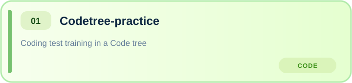
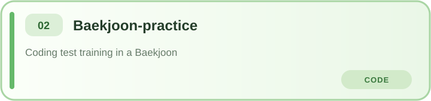
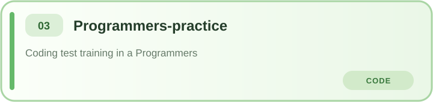

## 박윤서 (Yunseo Park)

 

    
 
         
         
          
    
    
  
 

    
### 🤓 About me
네트워크 흐름과 클라우드 보안을 중심으로 침해사고를 재현하고, 로그를 탐지 및 분석하는 프로젝트를 진행하고 있습니다.  
디지털 흔적을 근거로 침해 원인을 밝히고, 재발 방지까지 연결하는 CERT / DFIR 분석가를 목표로 공부하고 있습니다.

---

### 🛡️ Projects

<b>💻 Algorithm & Problem Solving</b>

 

  
  
  

---

### 📚 Education
- Kangnam University (2024. 03 ~ PRESENT)
- WhiteHat School 4th (2026. 06 ~ PRESENT)

---
